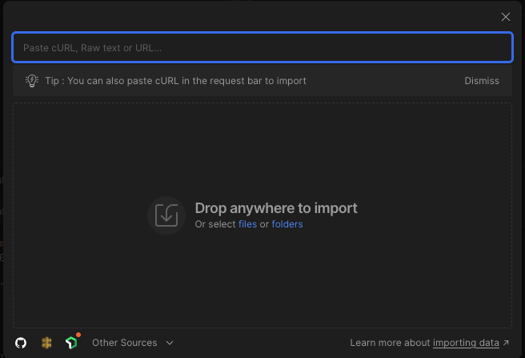

# Photo&Film4You Deployment Guia

Este documento proporciona una guía paso a paso para desplegar los servicios de WebService API y la WEB de Photo&Film4You utilizando Docker y Docker.

## Requisitos Previos

Antes de comenzar, asegúrate de que tienes instalado Docker y Docker Compose. Estas herramientas son necesarias para crear y gestionar tus contenedores. Consulta los siguientes enlaces para obtener instrucciones de instalación:

- Docker: [Obtener Docker](https://docs.docker.com/get-docker/)
- Docker Compose: [Instalar Docker Compose](https://docs.docker.com/compose/install/)

## Estructura de los Directorios

El proyecto debería tener la siguiente estructura de carpetas:

```
Photo&Film4You/
└── WebService/
└── web-photofilm/
└── docker-compose.yml (Para la API y la WEB)
```

## Despliegue del WebService API

Para levantar el proyecto, únicamente tendremos que levantar el docker. Dependiendo de si se utiliza windows o linux puede ser que docker compose lleve guión o no.
En el caso de Windows, necesitaremos tener instalado Docker desktop.

1. Desde el directorio raíz ejecuta el comando:
   ```
      docker-compose up --build
   ```

Este docker levanta los siguientes servicios:
1. Servicio del cliente (nginx)
2. Base de datos de los usuarios (postgres)
3. Base de datos de los productos (postgres)
4. Coordinación de los servicios (zookeper)
5. Servicio web de los usuarios (userws)
6. Servicio web de las noficaciones (notificationws)
7. Servicio web de los productos (productws)
8. Procesamiento de datos (kafka)

### En caso de querer ejecutar los WS de forma manual:
Es necesario entrar dentro de `./WebService`:
y en cada uno de los tres servicios sera necesario ejecutar los sigueintes comoandos, uno para cada nombre de servicio
```
java -jar productcatalog-0.1.0.jar --server.port=18081
java -jar user-0.1.0.jar --server.port=18082
java -jar notification-0.1.0.jar --server.port=18083
```
### En caso de querer ejecutar la web manualmente o en modo DEV
1. Acceder al directorio web
   ```cd ./web-photofilm```
2. Instalar las dependecias maven
   ```npm install```
3. Iniciar en modo desarollo
   ```npm run start```
4. Inciar en modo test
   ```npm run test```
5. Compilar las dependencias web manualmente
   ```npm run build```
   

6. Confirma que la API está operativa accediendo a uno de sus 3 servicios:
   
- Product Catalog App: `http://localhost:18081/endpoint`
- User App: `http://localhost:18082/endpoint`
- Notification App: `http://localhost:18083/endpoint`
- Web App con la tienda: `http://localhost`
- Web App con la tienda en modo desarollo: `http://localhost:4200`
  
## Prueba el Web Service con Postman
### Importación de Colecciones Postman

Esta guía proporciona instrucciones sobre cómo importar colecciones de Postman desde el directorio `POSTMAN` en nuestro repositorio.

### Pre-requisitos

- Asegúrate de tener [Postman](https://www.postman.com/downloads/) instalado en tu sistema.
- Debes tener acceso al directorio `POSTMAN` que contiene las colecciones de archivos `.json` de Postman.

### Pasos para Importar Colecciones de Postman

1. **Abrir Postman**:

   Inicia la aplicación Postman en tu computadora.

2. **Acceder a la Función de Importación**:

   En la esquina superior izquierda de la aplicación, encontrarás el botón `Import`. Haz clic en él.

   

3. **Seleccionar Archivos para Importar**:

   Se abrirá una ventana con varias opciones para importar. Puedes arrastrar y soltar los archivos directamente en esta ventana, o puedes hacer clic en el botón `File` para abrir un cuadro de diálogo de selección de archivos.

   

4. **Navegar al Directorio `POSTMAN`**:

   Utiliza el cuadro de diálogo para navegar al directorio donde se encuentra el repositorio y luego entra en la carpeta `POSTMAN`.

5. **Seleccionar los Archivos de Colección**:

   Elige los archivos de colección `.json` que desees importar. Puedes seleccionar múltiples archivos manteniendo presionado `Ctrl` (o `Cmd` en MacOS) mientras haces clic en cada archivo.

6. **Importar los Archivos**:

   Una vez que hayas seleccionado los archivos, haz clic en el botón `Open` en el cuadro de diálogo para proceder con la importación.

7. **Revisar las Colecciones Importadas**:

   Después de importar, las colecciones aparecerán en la barra lateral izquierda de Postman bajo la pestaña `Collections`.

8. **Listo**:

   Ahora puedes hacer clic en cualquier colección para ver las solicitudes individuales y comenzar a trabajar con ellas.

### Problemas Comunes

- **Formato Incorrecto**: Asegúrate de que los archivos que intentas importar son `.json` y están formateados correctamente para su uso en Postman.
- **Versiones Antiguas de Postman**: Si estás utilizando una versión antigua de Postman que no puede importar los archivos correctamente, considera actualizar a la última versión.


## Comandos Útiles

- Para ver los logs de un servicio:

```bash
docker-compose logs -f NOMBRE_DEL_SERVICIO
```

- Para detener los contenedores:

```bash
docker-compose down
```

- En caso de error al levantar un contenedor, en especial kafka:
_Intenta volver a levantar ese contenedor individual_

## Soporte

Si tienes problemas o preguntas acerca del despliegue, no dudes en contactar al equipo de desarrollo a través de los issues del repositorio del proyecto.
